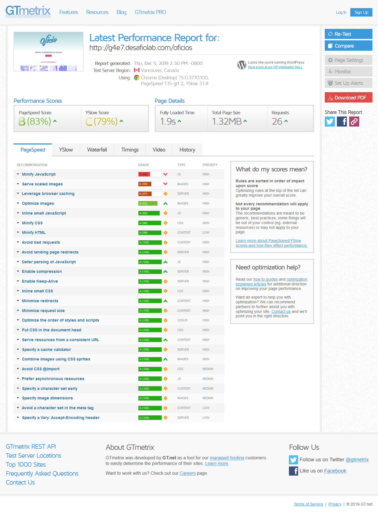
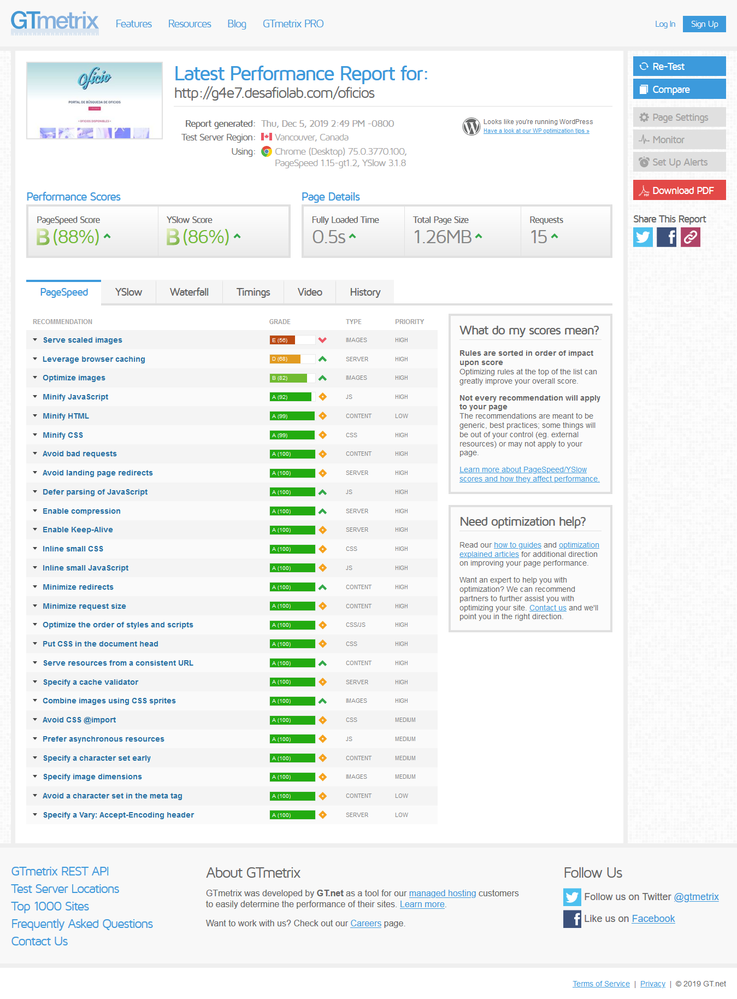
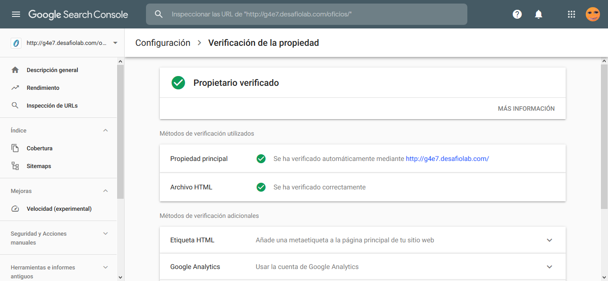
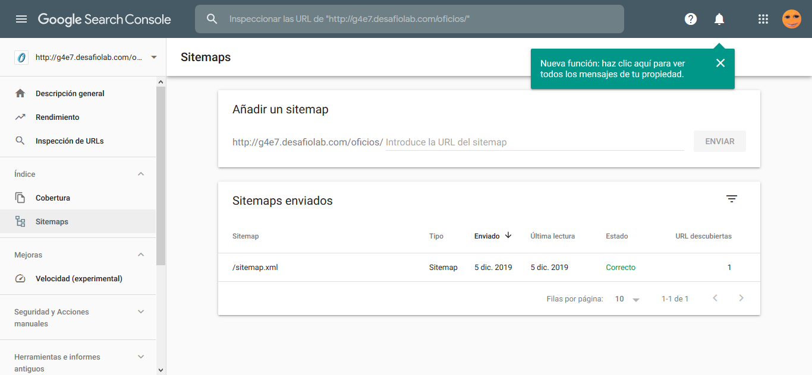

# Desafío: Oficio, Portal de búsqueda de oficios

### URL del sitio: [http://g4e7.desafiolab.com/oficios/](http://g4e7.desafiolab.com/oficios/)

## Optimización y seguridad en el sitio:
* Se reemplaza el archivo .htaccess para evitar accesos a terceros.
* Activación de Wordfence Security, firewall para evitar los virus y malware que pueden atacar el sitio. Se realiza escaneo para comprobar que todo esté correcto, aplicando las recomendaciones del plugin.
* Smush, para reducir el tamaño de las imágenes y optimizar la velocidad de carga.
* Autoptimize, para optimizar y minificar el código CSS, JS, imágenes, etc.
* Se integra Sitemap y para uso de Google Console.

## Resultados de evaluación de optimización según GTMetrix:
#### Resultado anterior a la aplicación de plugins optimización:

#### Resultado posterior a la aplicación de plugins optimización:
 El resultado de la velocidad de la página sube de 83% a 88% mientras que el puntaje YSlow aumentó de 79% a 86%.

## Integración con Google Search Console:

### URL del sitemap: [http://g4e7.desafiolab.com/oficios/sitemap.xml](http://g4e7.desafiolab.com/oficios/sitemap.xml)
